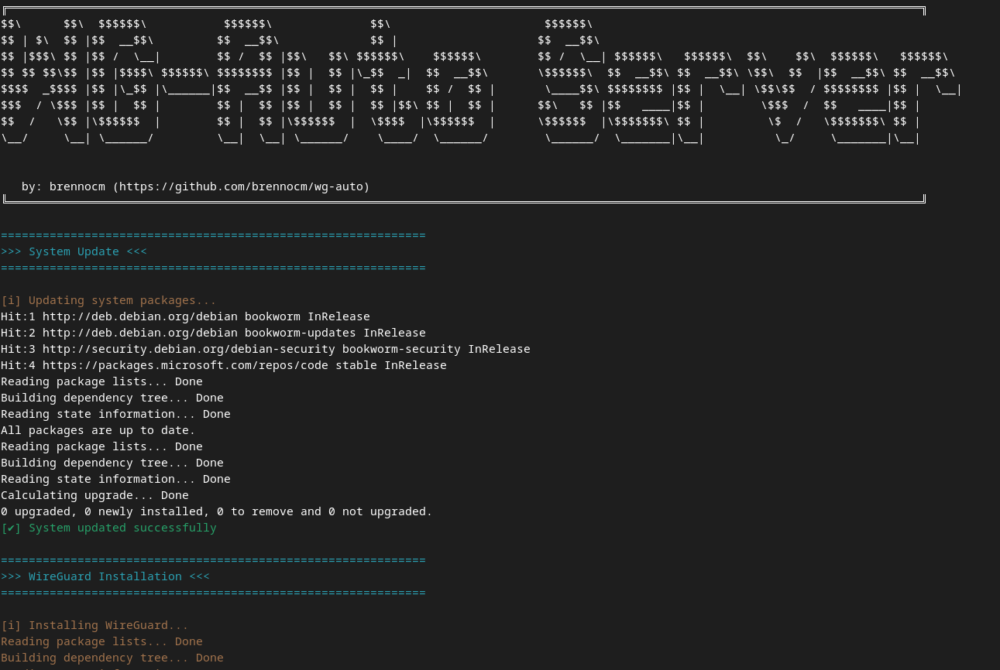

<div align="center">
    
   <br><br>
    <h1 align="center"> WG-Auto: Automating WireGuard VPN setup</h1>
</div>

WG-Auto is a tool designed to simplify and automate the installation and configuration of the WireGuard VPN, for servers and clients. With this script, you can quickly and efficiently set up your VPN without the need to manually configure each component.

### Features
- System Update: Automatically updates essential packages before starting the installation;
- WireGuard Installation: Installs the WireGuard package and verifies if the kernel module is loaded;
- Automated Configuration: Automatically generates keys and configuration files for server and client;
- IP Forwarding Configuration: Enables IP forwarding on the server and applies firewall rules using iptables;
- WireGuard Service: Configures and starts the WireGuard service on both server and client.

##### Server Features 
*   `Server Configuration`: Generates private and public keys and configures the server with an internal IP address;
*   `Firewall`: Applies NAT rules to forward VPN traffic to the main interface;
*   `Client Configuration Generation`: Provides guidance for adding [Peer] sections to the server configuration file.

##### Client Features
*   `Client Configuration`: Generates private and public keys and configurations to connect to the WireGuard server;
*   `Validators`: Ensures that the server IP address, port, and public key are provided in the correct format;
*   `Default DNS`: Configures default DNS to resolve domain names within the VPN.

<br>

<div align="center">
    
</div>

<br>

### How to Use?

##### Requirements
*   `Administrative Permissions`: Ensure the user has administrative permissions to run the scripts;
*   `Supported Distributions`: Tested on Debian-based distributions (like Ubuntu).

<br>

Clone the repository:
```bash
git clone https://github.com/brennocm/wg-auto.git
```

###### In server

Run the server setup script:
```bash
cd wg-auto
```
Make the script executable:
```bash
chmod +x wg-auto-server.sh
```

Run the script with administrative permissions:
```bash
sudo ./wg-auto-server.sh
```

###### In client

Navigate to the project directory:
```bash
cd wg-auto
```

Make the script executable::
```bash
chmod +x wg-auto-client.sh
```

Run the script with administrative permissions::
```bash
sudo ./wg-auto-client.sh
```

### Configuration File Structure

Server (/etc/wireguard/wg0.conf)
```bash
[Interface]
PrivateKey = <Server Private Key>
Address = 10.10.10.1/24
ListenPort = 51820
PostUp = iptables -A FORWARD -i %i -j ACCEPT; iptables -t nat -A POSTROUTING -o <Main_Interface> -j MASQUERADE
PostDown = iptables -D FORWARD -i %i -j ACCEPT; iptables -t nat -D POSTROUTING -o <Main_Interface> -j MASQUERADE

# Add [Peer] sections for each client here
```

Client (/etc/wireguard/wg0.conf)

```bash
[Interface]
PrivateKey = <Client Private Key>
Address = 10.10.10.2/24
DNS = 8.8.8.8, 8.8.4.4

[Peer]
PublicKey = <Server Public Key>
AllowedIPs = 0.0.0.0/0
Endpoint = <Server_IP>:51820
PersistentKeepalive = 25
```

### Notes

* Ensure WireGuard is installed on both the server and client before running the scripts.
* Adjust firewall settings as needed to meet your network security policies.